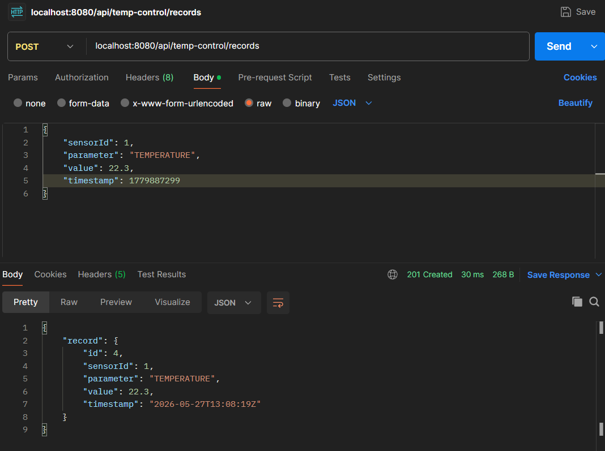
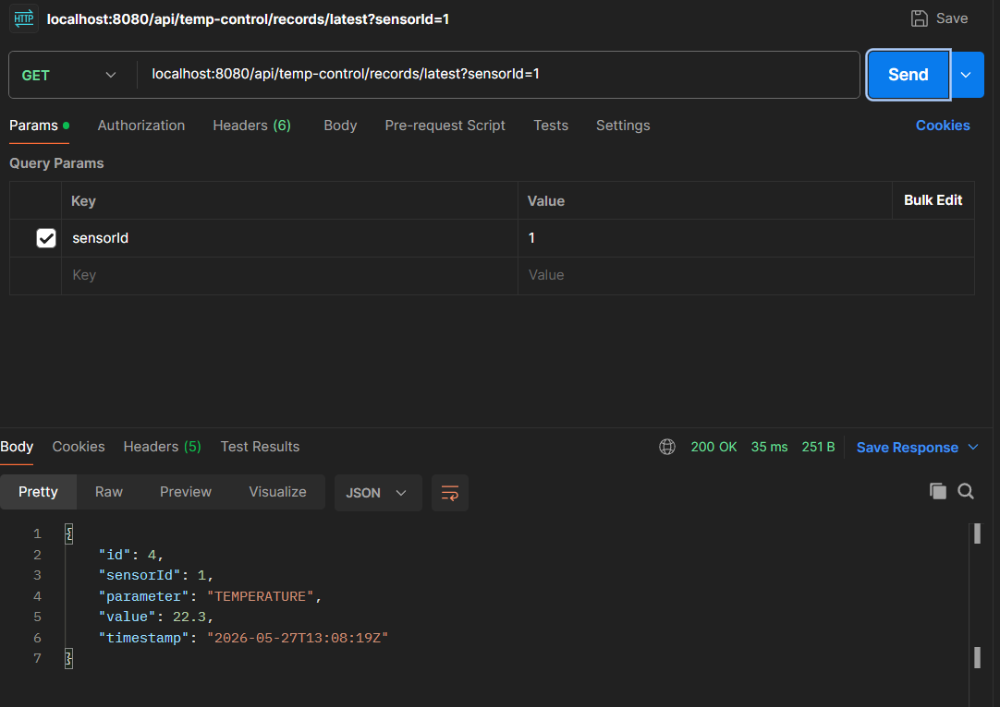
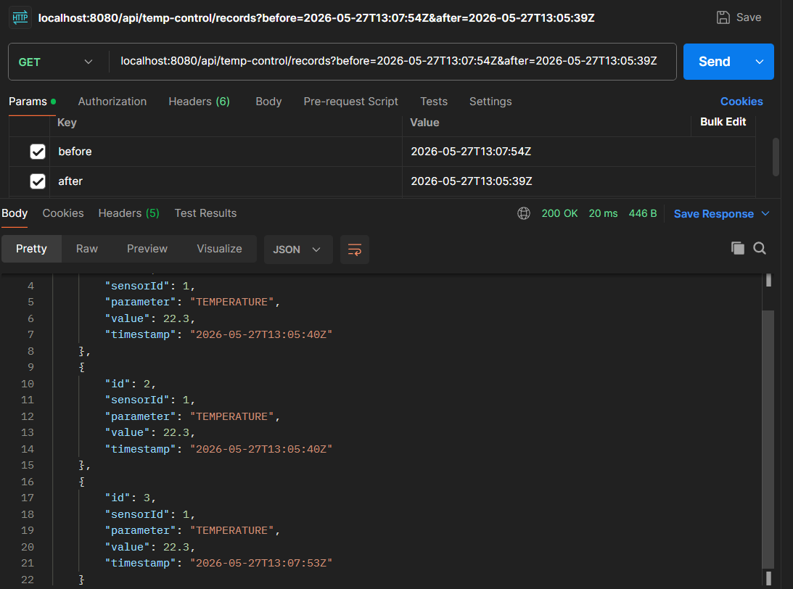

# SmartEnergy. Реляційне сховище даних

## Опис
Цей додаток реалізує реляційне сховище даних для проєкту SmartEnergy. Він є частиною більшого проєкту, який включає в
себе зберігання файлових та NoSQL даних для проєктів кафедри, таких як система моніторингу та контролю температури 
в приміщеннях.

## Функціональність
На даний момент реалізовано підтримку проєкту "Система моніторингу та контролю температури в приміщеннях".
Додаток дозволяє зберігати та отримувати дані з сенсорів.
Наразі містяться такі точки входу:
- `POST /api/temp-control/records`: Додає нові дані про температуру від сенсорів
- `GET /api/temp-control/records`: Отримує дані про температуру від сенсорів за певний період часу
(запит з параметрами `before` та `after` у форматі ISO 8601)
- `GET /api/temp-control/records/latest`: Отримує найновіші дані про температуру від сенсора (запит з параметром `sensorId`)

## Технології
- JDK 21
- Kotlin
- Spring Boot
- Spring Data JPA
- PostgreSQL
- Docker

## Запуск
1. Встановіть Docker та Docker Compose.
2. Клонувати репозиторій та перейти до папки з проектом.
3. Запустіть команду `docker-compose up` для запуску контейнерів з PostgreSQL.
4. Зберіть зображення додатку та запустіть його, використовуючи Docker, або стягніть його з Docker Hub, якщо воно там доступне.
5. Додаток буде доступний на `http://localhost:8080`.

## Тестування
На даний момент основними методами тестування є використання Postman для відправки HTTP-запитів до API.
Актуальна на 27.05.2026 року версія додатку була протестована на коректність роботи з базою даних та обробку запитів.

### Скріншоти
**Завантажено декілька семплів даних:**

**Отримано останній запис за ID сенсора:**

**Отримано набір даних за певний період часу:**
