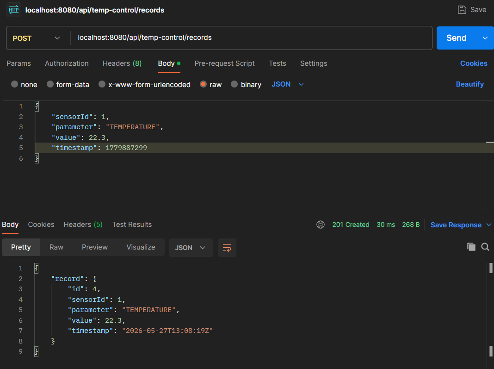
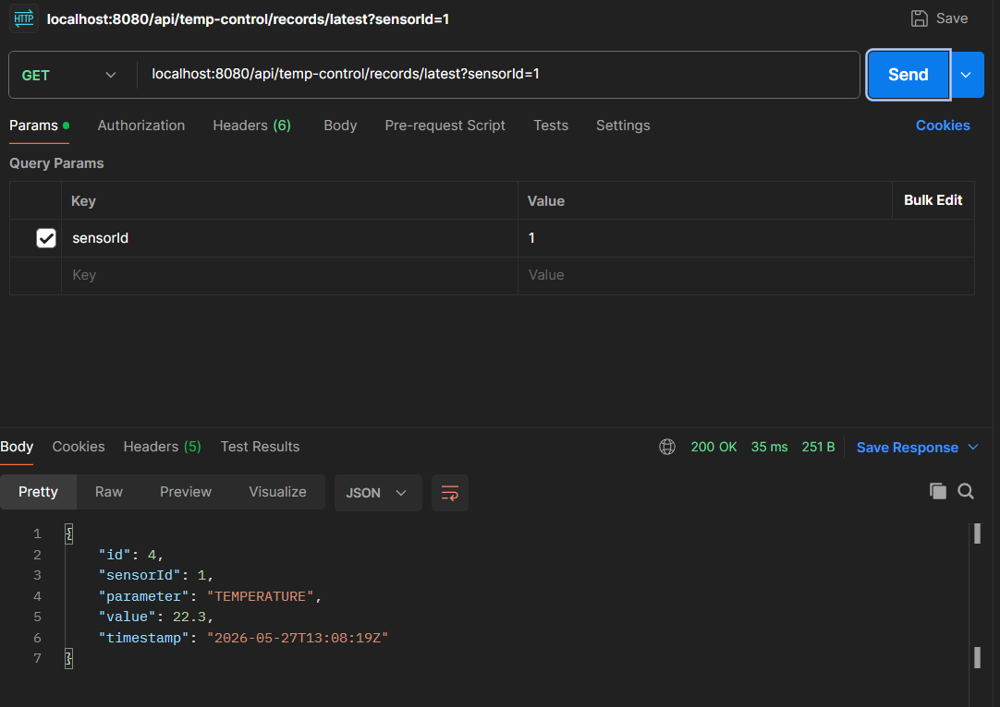
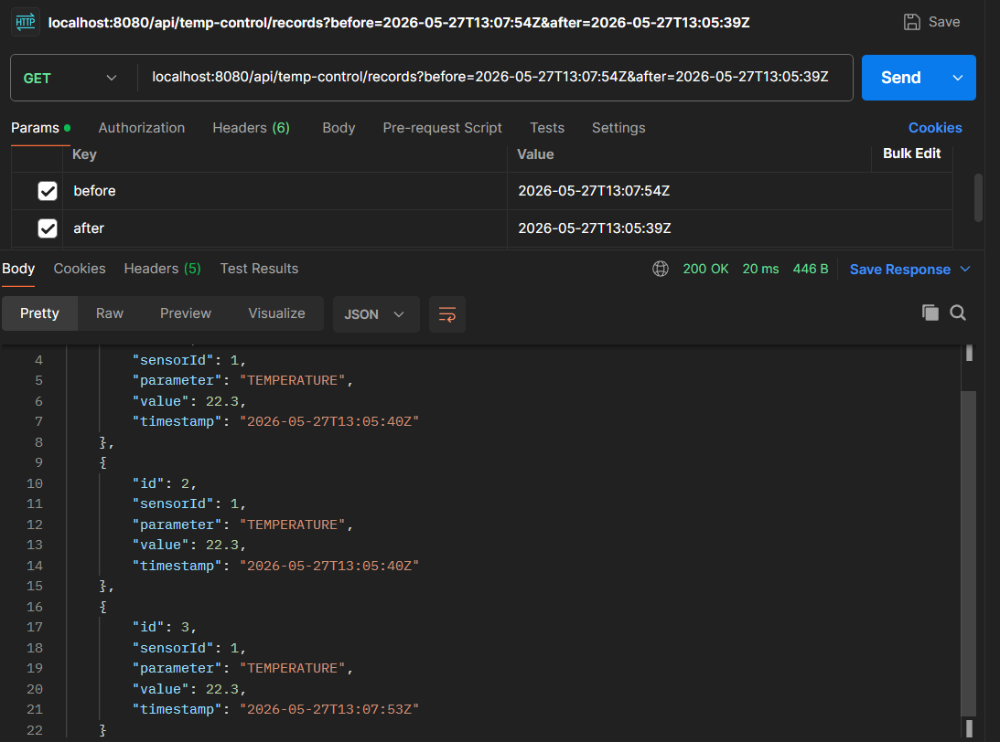

# SmartEnergy. Реляційне сховище даних

**Тема роботи:** «Прикладний програмний інтерфейс підсистеми керування реляційними даними програмного комплексу SmartEnergy».

## Опис
Цей додаток реалізує прикладний програмний інтерфейс (REST API) підсистеми керування реляційними даними програмного
комплексу SmartEnergy. Він є частиною більшого проєкту, який включає в себе зберігання файлових та NoSQL даних для
проєктів кафедри, таких як система моніторингу та контролю температури в приміщеннях.

Додаток приймає дані від інших підсистем через HTTP, зберігає їх у реляційній базі даних PostgreSQL та надає
можливість їх отримання й вибірки.

## Функціональність
На даний момент реалізовано підтримку проєкту "Система моніторингу та контролю температури в приміщеннях".
Додаток дозволяє зберігати та отримувати дані з сенсорів.
Наразі містяться такі точки входу:
- `POST /api/temp-control/records`: Додає нові дані про температуру від сенсорів
- `GET /api/temp-control/records`: Отримує дані про температуру від сенсорів за певний період часу
(запит з параметрами `before` та `after` у форматі ISO 8601)
- `GET /api/temp-control/records/latest`: Отримує найновіші дані про температуру від сенсора (запит з параметром `sensorId`)

## Технології
- JDK 21
- Kotlin 2.2
- Spring Boot 4 (Spring Web MVC, Spring Data JPA)
- PostgreSQL 18
- Flyway (міграції БД)
- springdoc-openapi (Swagger UI)
- Gradle 9 (через Gradle Wrapper)
- Docker, Docker Compose

## Необхідне програмне забезпечення
| ПЗ | Версія | Примітка |
|----|--------|----------|
| Операційна система | Windows 10/11, Linux або macOS | Будь-яка ОС, на якій працює Docker |
| Docker та Docker Compose | Docker Engine 24+ / Docker Desktop, Compose v2 | Обов'язково для обох способів запуску (у Docker запускається PostgreSQL) |
| Git | будь-яка актуальна | Для клонування репозиторію |
| JDK | 21 | Лише для запуску без Docker-образу додатку (з IDE або через `gradlew`) |
| IntelliJ IDEA | будь-яка актуальна | Необов'язково, для розробки |
| Postman або curl | будь-яка актуальна | Необов'язково, для надсилання запитів (замість них можна використовувати Swagger UI) |

Окремо встановлювати PostgreSQL, Gradle чи бібліотеки не потрібно:
- PostgreSQL 18 запускається в Docker-контейнері (`compose.yaml`);
- Gradle завантажується автоматично через Gradle Wrapper (`gradlew` / `gradlew.bat`);
- усі бібліотеки (Spring Boot, Flyway, драйвер PostgreSQL, springdoc-openapi тощо) завантажуються Gradle з Maven Central під час збирання.

Для роботи додатку мають бути вільні порти `8080` (додаток) та `5432` (PostgreSQL).

## Встановлення
1. Встановіть Docker (на Windows та macOS — Docker Desktop) і переконайтеся, що він запущений:
   ```shell
   docker --version
   docker compose version
   ```
2. (Лише для запуску без Docker-образу додатку) Встановіть JDK 21 і перевірте версію:
   ```shell
   java -version
   ```
3. Клонуйте репозиторій та перейдіть до папки з проєктом:
   ```shell
   git clone <URL репозиторію>
   cd smart-energy-relational-warehouse
   ```

## Запуск
Запустіть додаток одним із способів.

### Спосіб 1. Повністю в Docker (рекомендовано)
JDK встановлювати не потрібно — додаток збирається всередині Docker-образу.
```shell
docker compose --profile app up --build
```
Команда збирає образ додатку та запускає його разом з PostgreSQL. Для запуску у фоновому режимі додайте прапорець `-d`.

Зупинка:
```shell
docker compose --profile app down
```
Дані БД зберігаються в Docker-томі `postgres-data` і не втрачаються після перезапуску. Щоб повністю видалити дані,
виконайте `docker compose --profile app down -v`.

### Спосіб 2. З IDE або через Gradle
Потрібен JDK 21. Запустіть клас `SmartEnergyRelationalWarehouseApplication` з IDE або виконайте:
```shell
./gradlew bootRun      # Linux / macOS
gradlew.bat bootRun    # Windows
```
PostgreSQL запуститься автоматично (Spring Boot Docker Compose support), або його можна запустити вручну командою
`docker compose up` (лише БД).

### Перевірка запуску
Після запуску додаток доступний на `http://localhost:8080`. Під час старту Flyway автоматично створює потрібні таблиці
в БД. Щоб переконатися, що все працює, відкрийте в браузері `http://localhost:8080/swagger-ui.html`.

### Параметри підключення до БД
За замовчуванням використовуються такі параметри (задані в `compose.yaml` та `src/main/resources/application.yaml`):

| Параметр | Значення |
|----------|----------|
| Хост і порт | `localhost:5432` |
| База даних | `mydatabase` |
| Користувач | `myuser` |
| Пароль | `secret` |

Їх можна перевизначити змінними середовища `SPRING_DATASOURCE_URL`, `SPRING_DATASOURCE_USERNAME` та
`SPRING_DATASOURCE_PASSWORD`.

## Інструкція користувача
Взаємодія з додатком відбувається через HTTP-запити у форматі JSON. Надсилати запити можна:
- через **Swagger UI** у браузері (`http://localhost:8080/swagger-ui.html`) — найпростіший спосіб, не потребує
  додаткового ПЗ;
- через **Postman** або **curl**.

### Робота через Swagger UI
1. Відкрийте `http://localhost:8080/swagger-ui.html`.
2. Розгорніть групу **Temperature control** та оберіть потрібну точку входу.
3. Натисніть **Try it out**, заповніть параметри або тіло запиту (приклади значень підставляються автоматично).
4. Натисніть **Execute** — нижче з'явиться код та тіло відповіді.

### Формат запису сенсора
| Поле | Тип | Опис |
|------|-----|------|
| `id` | ціле число | Ідентифікатор запису (присвоюється автоматично, лише у відповіді) |
| `sensorId` | ціле число | Ідентифікатор сенсора |
| `parameter` | рядок | Вимірюваний параметр. Наразі підтримується лише `TEMPERATURE` (°C) |
| `value` | число | Виміряне значення в одиницях параметра |
| `timestamp` | рядок | Момент вимірювання у форматі ISO 8601, наприклад `2026-05-27T12:00:00Z` |

### 1. Додавання запису
`POST /api/temp-control/records`

```shell
curl -X POST http://localhost:8080/api/temp-control/records \
  -H "Content-Type: application/json" \
  -d '{"sensorId": 1, "parameter": "TEMPERATURE", "value": 21.5, "timestamp": "2026-05-27T12:00:00Z"}'
```
Відповідь `201 Created` містить збережений запис:
```json
{
  "record": { "id": 1, "sensorId": 1, "parameter": "TEMPERATURE", "value": 21.5, "timestamp": "2026-05-27T12:00:00Z" }
}
```
Якщо тіло запиту некоректне (відсутні поля, невідомий параметр, неправильний формат дати) — повертається `400 Bad Request`.

### 2. Отримання записів за період часу
`GET /api/temp-control/records?after=<початок>&before=<кінець>`

Повертає записи всіх сенсорів, у яких час вимірювання знаходиться строго між `after` та `before`.
```shell
curl "http://localhost:8080/api/temp-control/records?after=2026-05-27T00:00:00Z&before=2026-05-28T00:00:00Z"
```
Відповідь `200 OK` — масив записів (порожній `[]`, якщо записів за період немає). Якщо параметр відсутній або має
неправильний формат — `400 Bad Request`.

### 3. Отримання останнього запису сенсора
`GET /api/temp-control/records/latest?sensorId=<ідентифікатор>`

```shell
curl "http://localhost:8080/api/temp-control/records/latest?sensorId=1"
```
Відповідь `200 OK` — запис з найновішим часом вимірювання для вказаного сенсора. Якщо для сенсора немає жодного
запису — `404 Not Found`.

> **Примітка для Windows (PowerShell):** використовуйте `curl.exe` замість `curl`, оскільки в Windows PowerShell
> `curl` є псевдонімом команди `Invoke-WebRequest`. Для запитів з тілом JSON зручніше використовувати Swagger UI або Postman.

## Документація API
Специфікація OpenAPI генерується автоматично з коду (springdoc-openapi та анотації Swagger у контролерах і DTO).
- Swagger UI запущеного додатку: `http://localhost:8080/swagger-ui.html`
- Специфікація: `http://localhost:8080/v3/api-docs` (JSON) та `http://localhost:8080/v3/api-docs.yaml` (YAML)
- Згенерувати файли специфікації без запуску додатку та БД: `./gradlew generateOpenApiSpec` — результат у `build/openapi/openapi.json` та `build/openapi/openapi.yaml`.

## Міграції бази даних
Схема БД керується за допомогою [Flyway](https://documentation.red-gate.com/flyway). Міграції застосовуються автоматично під час запуску додатку.
- Файли міграцій знаходяться в `src/main/resources/db/migration`.
- Назва файлу: `V<версія>__<опис>.sql`, наприклад `V2__add_humidity_parameter.sql`.
- Вже застосовані міграції **не можна змінювати** — для будь-яких змін схеми створюйте нову міграцію з наступним номером версії.
- Hibernate не змінює схему, а лише перевіряє її відповідність сутностям (`ddl-auto: validate`), тому кожна зміна сутностей має супроводжуватися відповідною міграцією.

## Тестування
На даний момент основними методами тестування є використання Postman для відправки HTTP-запитів до API.
Актуальна на 27.05.2026 року версія додатку була протестована на коректність роботи з базою даних та обробку запитів.

### Скріншоти
**Завантажено декілька семплів даних:**


**Отримано останній запис за ID сенсора:**


**Отримано набір даних за певний період часу:**

